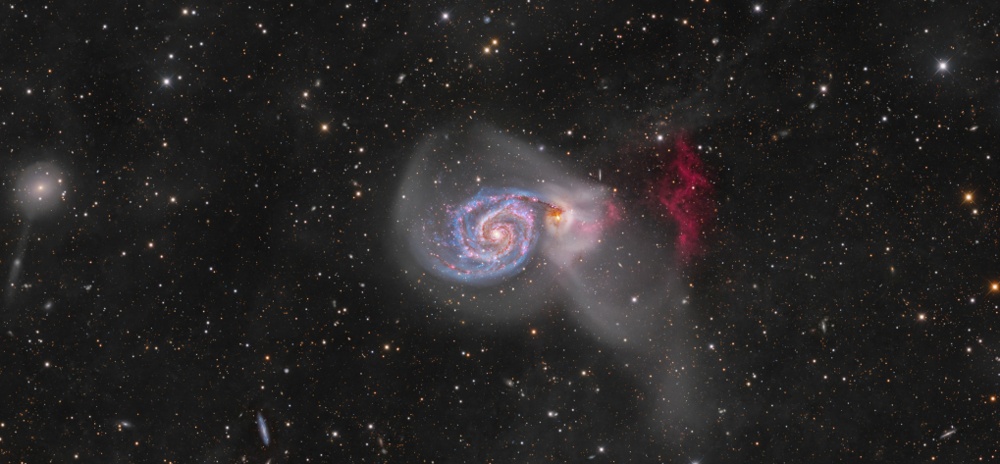

# Solar Aurora Dashboard App

Real-time aurora borealis (Northern Lights) forecasting application for Finland. Displays live solar wind activity data and calculates aurora visibility probabilities for different cities.

## Quick Start
1. Clone the repository
2. Install dependencies: `npm install`
3. Get your NASA API key from [api.nasa.gov](https://api.nasa.gov/)
4. Copy `.env.example` to `.env` and add your API key
5. Run the app: `npm start`

## Features
- Aurora probability forecasts for Finnish cities
- Real-time solar wind activity monitoring
- Interactive map visualization
- NASA Astronomy Picture of the Day
- Automatic updates every 15 minutes
- Solar event tracking (CMEs, Solar Flares, High-Speed Streams)
- Aurora visibility zones
- Best viewing time calculations
- #TODO - Add weather forecasting with interactive visusalization

## Technologies
- TypeScript
- Electron
- Chart.js for data visualization
- Leaflet for interactive maps
- NASA APOD API integration
- Real-time data updates
- Geolocation-based predictions

## Map Features
- Dynamic aurora probability zones
- City-specific forecasts
- TODO Interactive markers with detailed information
- Dark theme optimized for aurora viewing
- TODO Animated aurora band visualization

## Forecast Algorithm
The app calculates aurora visibility probabilities based on:
- Solar wind speed and density
- Geomagnetic activity (Kp index)
- Geographic location
- Historical data patterns
- Viewing conditions

## License
MIT License

## Acknowledgments
- NASA APOD API for space imagery
- OpenStreetMap contributors
- CARTO for map tiles
